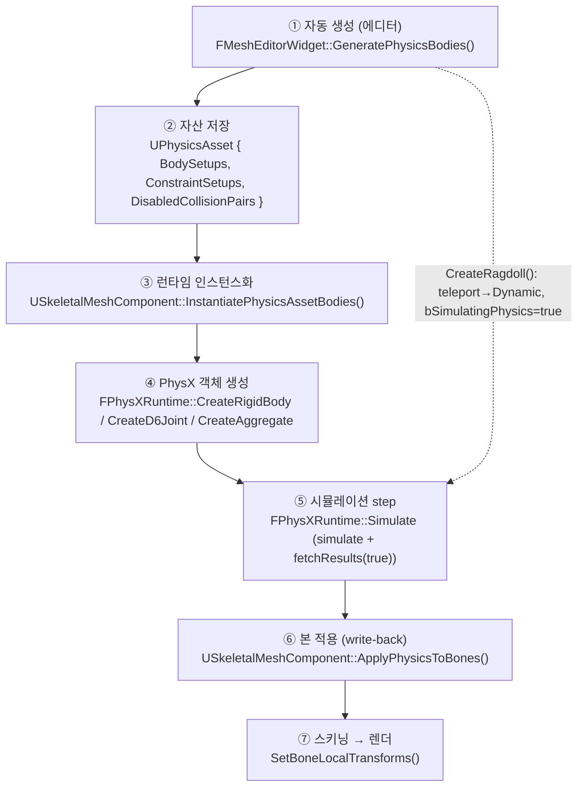

# 00. 전체 파이프라인 한눈에

> **대상**: 자체 엔진(DX11 + PhysX 4.1, Unreal 참조)의 ragdoll & D6 joint 물리.
> **범위**: rigid body / D6 joint / 앵커 / 한계 / 런타임 write-back / 좌표수학. **cloth(NvCloth)는 제외**.
> **읽는 순서 제안**: 이 문서(00) → [06](06_coordinate_math.md) 수학규약 → [01](01_rigid_body_setup.md) → [02](02_d6_joint_theory.md) → [03](03_anchor_frames.md) → [04](04_angular_limits.md) → [05](05_runtime_and_collision.md) → [07](07_glossary_and_gaps.md).

## 0. 두 가지 주의 (규칙)
1. **라인 번호는 확인 시점(2026-06-01) 스냅샷**이다. 각 인용은 심볼명을 함께 적었으니, 어긋나면 심볼로 재확인할 것.
2. **stale 주석 주의**: 예) `MeshEditorWidget.Physics.cpp:1050`에 "GeneratePhysicsBodies는 아직 stub"이라 적혀 있으나 `:1143`에 전체 구현이 존재한다. 주석/표시를 코드 동작의 근거로 삼지 말 것.
3. 엔진 소스는 모두 `KraftonEngine/Source/...` 아래에 있다(이 문서들의 상대경로는 이 접두어 생략형).

---

## 1. 파이프라인 흐름

- ①②는 **편집 타임**(에디터에서 자산을 만들고 디스크에 저장).
- ③④는 시뮬 시작 시 **자산 → PhysX 객체**로 1:1 실체화.
- ⑤⑥⑦은 매 프레임 루프. 에디터 미리보기는 ⑤⑥을 `TickPhysicsSimulation`이 직접 돌리고, 런타임은 `UWorld` step + `TickComponent`가 분담한다([05](05_runtime_and_collision.md) 2.3).

### 데이터가 채워지고 소비되는 지점
| 단계 | 채움 | 소비 |
|---|---|---|
| ① 자동생성 | `UBodySetup.AggregateGeom`, `UPhysicsConstraintSetup.{ParentAnchorPos/Rot, *Motion, *LimitAngle}`, `DisabledCollisionPairs` | — |
| ③ 인스턴스화 | `FPhysicsBodyDesc`, `FPhysicsConstraintDesc`(3단 프레임·deg→rad), `Bodies[]`, `Constraints[]` | ①의 자산 |
| ④ PhysX | `PxRigidDynamic`, `PxD6Joint`, `PxAggregate` | ③의 Desc |
| ⑤ step | `FBodyInstance.CachedWorldTransform` | ④의 actor |
| ⑥ write-back | 본 `LocalPose[]` | ⑤의 캐시 |

---

## 2. 단계별 책임 파일·핵심 심볼

| 단계 | 핵심 심볼 | 파일 (스냅샷 라인) |
|---|---|---|
| ① 자동생성 진입 | `FMeshEditorWidget::GeneratePhysicsBodies` | `Editor/UI/Asset/Mesh/MeshEditorWidget.Physics.cpp:1143` |
| ① 본정렬·앵커 헬퍼 | `AutoGen_AlignXToDir` / `AutoGen_ComputeConstraintAnchorLocal` | 같은 파일 `:110` / `:128` |
| ① 수동 컨스트레인트 | `CreateConstraintWith` | 같은 파일 `:488` |
| ② 자산 | `UPhysicsAsset` / `UBodySetup` / `UPhysicsConstraintSetup` | `Engine/Physics/Asset/PhysicsAsset.{h,cpp}`, `BodySetup.h`, `PhysicsConstraintSetup.h` |
| ② 멱등/순서 | `GetOrCreateConstraintSetup`(멱등) / `FindConstraintSetup`(순서 민감) | `PhysicsAsset.cpp:33` / `:17` |
| ③ 인스턴스화 | `USkeletalMeshComponent::InstantiatePhysicsAssetBodies` | `Engine/Component/Primitive/SkeletalMeshComponent.cpp:724` |
| ③ enum/단위 변환 | `ToPhysicsMotion` / `DegreesToRadians` / `AppendPhysicsShapes` | 같은 파일 `:40` / `:35` / `:77` |
| ④ 강체 | `FPhysXRuntime::CreateRigidBody` / `CreateShape_AssumesLocked` | `Engine/Physics/PhysXRuntime.cpp:704` / `:861` |
| ④ 조인트 | `FPhysXRuntime::CreateD6Joint` | 같은 파일 `:904` |
| ④ aggregate | `FPhysXRuntime::CreateAggregate` | 같은 파일 `:806` |
| ④ 변환 헬퍼 | `PhysXHelpers::ToPxTransform / ToPxD6Motion / BuildGeometry` | `Engine/Physics/PhysXHelpers.h:28 / :38 / :68` |
| ⑤ step | `FPhysXRuntime::Simulate` (`simulate`/`fetchResults`) | `PhysXRuntime.cpp:556` (`:649`/`:650`) |
| ⑥ write-back | `USkeletalMeshComponent::ApplyPhysicsToBones` / `CreateRagdoll` | `SkeletalMeshComponent.cpp:1005` / `~:940` |
| ⑤⑥ 에디터 구동 | `FMeshEditorWidget::TickPhysicsSimulation` / `StartPhysicsSimulation` | `MeshEditorWidget.Physics.cpp:1452` / `:1364` |
| 수학 | `FMatrix` / `FQuat` / 본 포즈 누적 | `Engine/Math/Matrix.{h,cpp}`, `Quat.h`, `Mesh/Skeletal/SkeletalMeshAsset.h:208` |
| 인터페이스 | `IPhysicsScene` (구현 `FPhysXRuntime`) | `Engine/Physics/IPhysicsScene.h` |

---

## 3. 엔진 타입 ↔ PhysX 타입 한눈표

| 엔진 타입/심볼 | PhysX 타입 | 변환·생성 지점 |
|---|---|---|
| `FVector` / `FQuat` / `FTransform` | `PxVec3` / `PxQuat` / `PxTransform` | `PhysXHelpers::ToPx*` (1:1, 축 변환 없음) |
| `UBodySetup` + `FKAggregateGeom` | `PxRigidDynamic` + `PxShape[]` | `CreateRigidBody`/`CreateShape_AssumesLocked` |
| `FK{Sphere,Box,Capsule}Elem` | `Px{Sphere,Box,Capsule}Geometry` | `BuildGeometry` (`PhysXHelpers.h:68`) |
| `UPhysicsConstraintSetup` → `FPhysicsConstraintDesc` | `PxD6Joint` | `CreateD6Joint` |
| `EConstraintMotion`→`EPhysicsMotionType` | `PxD6Motion` (`eLOCKED/eLIMITED/eFREE`) | `ToPhysicsMotion`→`ToPxD6Motion` |
| `Twist/Swing1/Swing2` 축 | `PxD6Axis::eTWIST/eSWING1/eSWING2` | `CreateD6Joint setMotion` |
| twist min/max, swing1/2 | `PxJointAngularLimitPair`, `PxJointLimitCone` | `setTwistLimit`/`setSwingLimit` |
| `bEnableSelfCollision` | `PxAggregate(enableSelfCollision)` | `CreateAggregate` |
| `FBodyInstance` / `FConstraintInstance` | `PxRigidActor*` / `PxD6Joint*` (`NativePtr`) | 래퍼 |

---

## 4. 핵심 설계 요약 (각 문서의 결론)
- **좌표**: row-major + **행벡터**(`v·M`, `Global=Local·ParentGlobal`), 엔진↔PhysX 1:1, +X정면/+Z상, 캡슐 장축 +X. → [06](06_coordinate_math.md)
- **바디**: 본 정점 AABB로 크기, 최장자식 방향으로 캡슐/박스/구 배치. **"Mass" 필드는 실제로 density로 소비**(질량=density×부피). → [01](01_rigid_body_setup.md)
- **조인트**: D6 6축, 6 setMotion + twist/swing limit. drive·breakable 미사용. → [02](02_d6_joint_theory.md)
- **앵커**: 부모앵커 1개만 저장, `Rel=Child.Global·Parent.Global⁻¹`로 pivot=자식본원점·X=뼈축. 인스턴스화 3단 변환으로 초기 오차 0. → [03](03_anchor_frames.md)
- **한계**: deg→rad, twist는 ±대칭(단일 슬라이더), swing은 타원뿔, 전부 hard limit. → [04](04_angular_limits.md)
- **런타임**: `simulate`+`fetchResults(true)` 후 `ApplyPhysicsToBones`로 body→본 역산. 단일스레드 직렬화로 race 없음. 자기충돌은 aggregate 전역 토글만(per-pair는 미배선 gap). → [05](05_runtime_and_collision.md)
- **미사용/이슈/미확인**: → [07](07_glossary_and_gaps.md)
