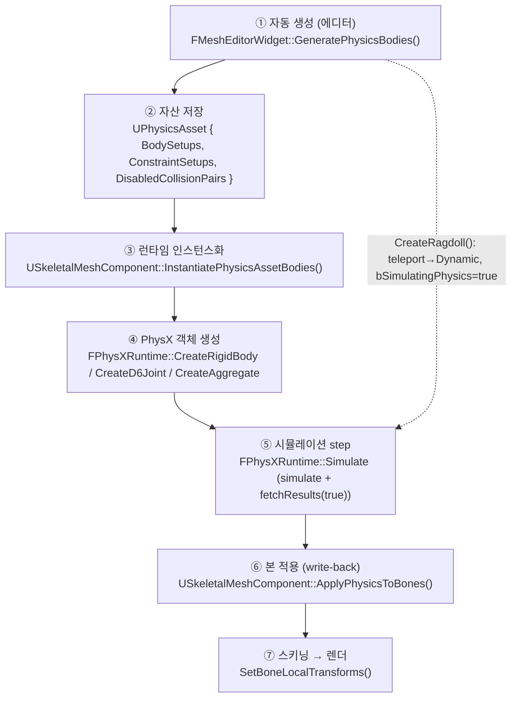

# 00. 전체 파이프라인 한눈에

> **대상**: 자체 엔진(DX11 + PhysX 4.1, Unreal 참조)의 ragdoll & D6 joint 물리.
> **범위**: rigid body / D6 joint / 앵커 / 한계 / 런타임 write-back / 좌표수학. **cloth(NvCloth)는 제외**.
> **읽는 순서 제안**: 이 문서(00) → [06](06_coordinate_math.md) 수학규약 → [01](01_rigid_body_setup.md) → [02](02_d6_joint_theory.md) → [03](03_anchor_frames.md) → [04](04_angular_limits.md) → [05](05_runtime_and_collision.md) → [07](07_glossary_and_gaps.md).

## 0. 읽기 전 주의 (규칙)
1. **라인 번호는 확인 시점(2026-06-03) 스냅샷**이다. 각 인용은 심볼명을 함께 적었으니, 어긋나면 심볼로 재확인할 것.
2. **stale 주석 주의**: 예) `PhysicsEditorWidget.cpp:1071`(+`MeshEditorWidget.h:170`)에 "GeneratePhysicsBodies는 아직 stub"이라 적혀 있으나 `PhysicsEditorWidget.cpp:1164`에 전체 구현이 존재한다. 시뮬레이션도 `:1378~1379`/`:1512~1518`에 "UI hook만 열어둔 stub"·"bSimulatingPhysics를 끄는 API 없음"이라는 stale 주석이 남아 있으나 실제로는 전부 배선돼 있다. 주석/표시를 코드 동작의 근거로 삼지 말 것.
3. 엔진 소스는 모두 `KraftonEngine/Source/...` 아래에 있다(이 문서들의 상대경로는 이 접두어 생략형).
4. **에디터 물리 코드는 파일이 분리됐다**: 과거 `MeshEditorWidget.Physics.cpp`의 물리 탭 멤버함수 정의는 전부 신규 파일 **`Editor/UI/Asset/Mesh/PhysicsEditorWidget.cpp`**(약 2235줄)로 옮겨졌다. **클래스는 여전히 `FMeshEditorWidget`**이고 선언은 `MeshEditorWidget.h`에 그대로 있으며, `MeshEditorWidget.cpp`는 이 메서드들을 호출만 한다. 아래 표/인용의 `MeshEditorWidget.Physics.cpp`는 모두 `PhysicsEditorWidget.cpp`로 읽을 것.

---

## 1. 파이프라인 흐름



- ①②는 **편집 타임**(에디터에서 자산을 만들고 디스크에 저장).
- ③④는 시뮬 시작 시 **자산 → PhysX 객체**로 1:1 실체화.
- ⑤⑥⑦은 매 프레임 루프. 에디터 미리보기는 ⑤⑥을 `TickPhysicsSimulation`이 직접 돌리고, 런타임은 `UWorld` step + `TickComponent`가 분담한다([05](05_runtime_and_collision.md) 2.3).

### 데이터가 채워지고 소비되는 지점
| 단계 | 채움 | 소비 |
|---|---|---|
| ① 자동생성 | `UBodySetup.AggregateGeom`, `UPhysicsConstraintSetup.{ParentAnchorPos/Rot, *Motion, *LimitAngle}`, `DisabledCollisionPairs` | — |
| ③ 인스턴스화 | `FPhysicsBodyDesc`, `FPhysicsConstraintDesc`(3단 프레임·deg→rad), `Bodies[]`, `Constraints[]` | ①의 자산 |
| ④ PhysX | `PxRigidDynamic`, `PxD6Joint`, `PxAggregate` | ③의 Desc |
| ⑤ step | `FBodyInstance.CachedWorldTransform` | ④의 actor |
| ⑥ write-back | 본 `LocalPose[]` | ⑤의 캐시 |

---

## 2. 단계별 책임 파일·핵심 심볼

| 단계 | 핵심 심볼 | 파일 (스냅샷 라인) |
|---|---|---|
| ① 자동생성 진입 | `FMeshEditorWidget::GeneratePhysicsBodies` | `Editor/UI/Asset/Mesh/PhysicsEditorWidget.cpp:1164` |
| ① 본정렬·앵커 헬퍼 | `AutoGen_AlignXToDir` / `AutoGen_ComputeConstraintAnchorLocal` | 같은 파일 `:92` / `:110` |
| ① 수동 컨스트레인트 | `CreateConstraintWith`(`RenderPhysicsBoneTree` 내부 람다) | 같은 파일 `:470` |
| ② 자산 | `UPhysicsAsset` / `UBodySetup` / `UPhysicsConstraintSetup` | `Engine/Physics/Asset/PhysicsAsset.{h,cpp}`, `BodySetup.h`, `PhysicsConstraintSetup.h` |
| ② 멱등/순서 | `GetOrCreateConstraintSetup`(멱등) / `FindConstraintSetup`(순서 민감) | `PhysicsAsset.cpp:36` / `:20` |
| ③ 인스턴스화 | `USkeletalMeshComponent::InstantiatePhysicsAssetBodies` | `Engine/Component/Primitive/SkeletalMeshComponent.cpp:774` (1-인자 fwd `:769`) |
| ③ enum/단위 변환 | `ToPhysicsMotion` / `DegreesToRadians` / `AppendPhysicsShapes` | 같은 파일 `:45` / `:40` / `:95` |
| ④ 강체 | `FPhysXRuntime::CreateRigidBody` / `CreateShape_AssumesLocked` | `Engine/Physics/PhysXRuntime.cpp:1370` / `:1556` |
| ④ 조인트 | `FPhysXRuntime::CreateD6Joint` | 같은 파일 `:1650` |
| ④ aggregate | `FPhysXRuntime::CreateAggregate` | 같은 파일 `:1494` |
| ④ 변환 헬퍼 | `PhysXHelpers::ToPxTransform / ToPxD6Motion / BuildGeometry` | `Engine/Physics/PhysXHelpers.h:28 / :38 / :68` |
| ⑤ step | `FPhysXRuntime::Simulate` (`simulate`/`fetchResults`) | `PhysXRuntime.cpp:1217` (`:1310`/`:1311`) |
| ⑥ write-back | `USkeletalMeshComponent::ApplyPhysicsToBones` / `CreateRagdoll`→`EnterRagdollState` | `SkeletalMeshComponent.cpp:1386` / `:1148`→`:1062` |
| ⑤⑥ 에디터 구동 | `FMeshEditorWidget::TickPhysicsSimulation` / `StartPhysicsSimulation` | `PhysicsEditorWidget.cpp:1536` / `:1385` |
| 수학 | `FMatrix` / `FQuat` / 본 포즈 누적 | `Engine/Math/Matrix.{h,cpp}`, `Quat.h`, `Mesh/Skeletal/SkeletalMeshAsset.h:208` |
| 인터페이스 | `IPhysicsScene` (구현 `FPhysXRuntime`) | `Engine/Physics/IPhysicsScene.h` |
| ④ 시뮬 필터 | `KraftonRagdollFilterShader`(커스텀, scene에 배선) | `PhysXRuntime.cpp:327` (assign `:970`) |

---

## 3. 엔진 타입 ↔ PhysX 타입 한눈표

| 엔진 타입/심볼 | PhysX 타입 | 변환·생성 지점 |
|---|---|---|
| `FVector` / `FQuat` / `FTransform` | `PxVec3` / `PxQuat` / `PxTransform` | `PhysXHelpers::ToPx*` (1:1, 축 변환 없음) |
| `UBodySetup` + `FKAggregateGeom` | `PxRigidDynamic` + `PxShape[]` | `CreateRigidBody`/`CreateShape_AssumesLocked` |
| `FK{Sphere,Box,Capsule}Elem` | `Px{Sphere,Box,Capsule}Geometry` | `BuildGeometry` (`PhysXHelpers.h:68`) |
| `UPhysicsConstraintSetup` → `FPhysicsConstraintDesc` | `PxD6Joint` | `CreateD6Joint` |
| `EConstraintMotion`→`EPhysicsMotionType` | `PxD6Motion` (`eLOCKED/eLIMITED/eFREE`) | `ToPhysicsMotion`→`ToPxD6Motion` |
| `Twist/Swing1/Swing2` 축 | `PxD6Axis::eTWIST/eSWING1/eSWING2` | `CreateD6Joint setMotion` |
| twist min/max, swing1/2 | `PxJointAngularLimitPair`, `PxJointLimitCone` | `setTwistLimit`/`setSwingLimit` |
| `bEnableSelfCollision` | `PxAggregate(enableSelfCollision)` | `CreateAggregate` |
| `FBodyInstance` / `FConstraintInstance` | `PxRigidActor*` / `PxD6Joint*` (`NativePtr`) | 래퍼 |

---

## 4. 핵심 설계 요약 (각 문서의 결론)
- **좌표**: row-major + **행벡터**(`v·M`, `Global=Local·ParentGlobal`), 엔진↔PhysX 1:1, +X정면/+Z상, 캡슐 장축 +X. → [06](06_coordinate_math.md)
- **바디**: 본 정점 AABB로 크기, 최장자식 방향으로 캡슐/박스/구 배치. **"Mass" 필드는 실제로 density로 소비**(질량=density×부피). → [01](01_rigid_body_setup.md)
- **조인트**: D6 6축, 6 setMotion + twist/swing limit. drive·breakable 미사용. → [02](02_d6_joint_theory.md)
- **앵커**: 부모앵커 1개만 저장, `Rel=Child.Global·Parent.Global⁻¹`로 pivot=자식본원점·X=뼈축. 인스턴스화 3단 변환으로 초기 오차 0. → [03](03_anchor_frames.md)
- **한계**: deg→rad, twist는 ±대칭(단일 슬라이더), swing은 타원뿔, 전부 hard limit. → [04](04_angular_limits.md)
- **런타임**: `simulate`+`fetchResults(true)` 후 `ApplyPhysicsToBones`로 body→본 역산(BodyToBoneOffset 적용 + 글로벌 단계 scale-1 정규화). 단일스레드 직렬화로 race 없음. 자기충돌은 **(a) self-collision OFF: aggregate 전역 토글**, **(b) self-collision ON: per-pair `DisabledCollisionPairs`를 `SetRagdollBodyFilter`로 커스텀 필터 셰이더에 배선**(과거 "미배선 gap"은 해소됨). → [05](05_runtime_and_collision.md)
- **미사용/이슈/미확인 + 신규(triangle mesh, scale 베이킹, 커스텀 필터셰이더)**: → [07](07_glossary_and_gaps.md)

---

## 5. 파이프라인 단계별 상세 (역할 · 실제 코드 · PhysX 동작)

§1의 ①~⑦을 한 단계씩 풀어 쓴다. 각 단계마다 **(역할)** 무엇을 하는가 → **(코드)** 어디서 그 일이 일어나는가 → **(PhysX)** 그 결과가 PhysX의 어떤 타입/API로 실현되는가. 라인은 2026-06-03 스냅샷.

> 큰 그림 한 줄: **①② "설계(자산)" → ③ "자산을 PhysX 디스크립터로 번역" → ④ "디스크립터로 PhysX actor/joint 실체화" → ⑤ "PhysX가 적분·constraint solve" → ⑥⑦ "PhysX 결과를 본으로 역산해 메시 변형"**. ①②는 엔진 개념만 다루고 PhysX를 모른다; ④만이 실제 PhysX SDK를 호출한다; ⑤는 PhysX 내부; ⑥⑦은 다시 엔진 좌표계로 돌아온다.

### 5.1 ① 자동 생성 (에디터) — 본 → BodySetup/ConstraintSetup
- **(역할)** 스켈레톤만 있는 메시에서 "어느 본에 어떤 콜리전 형상을, 어떤 관절로 이을지"를 자동 설계한다. 사람이 손으로 캡슐을 다 박지 않아도 되게 하는 편집-타임 1회 작업. PhysX는 전혀 등장하지 않고, 순수하게 엔진 자산(`UBodySetup`/`UPhysicsConstraintSetup`)만 채운다.
- **(코드)** `FMeshEditorWidget::GeneratePhysicsBodies()` (`Editor/UI/Asset/Mesh/PhysicsEditorWidget.cpp:1164`). 본별 스키닝 정점 AABB의 최대 변(`:1210` skin-weight 0.2 컷)으로 크기를 잡고, **가장 먼 자식 방향**으로 형상을 눕힌다(`:1281~1323`):
  ```cpp
  const float   L = Lmax;                                   // :1283 최장 자식까지 거리
  const FVector d = Asset->Bones[cStar].GetReferenceLocalPose().GetLocation().Normalized();
  const FVector Center = d * (L * 0.5f);                     // :1285 본↔자식 중점
  const FQuat   Rot = S.bOrientAlongBone ? AutoGen_AlignXToDir(d) : FQuat::Identity;  // :1286 X→본방향
  // Capsule(기본): Center, Rot, Radius=clamp(L*ratio,...), HalfHeight=L*0.5 (center→tip)   :1308~1310
  ```
  조인트는 바디 생성 직후 "바디 보유 최근접 조상"을 부모로 골라(`:1332~1333`) `GetOrCreateConstraintSetup`(멱등)으로 만들고, 앵커는 자동/수동 공유 헬퍼 `AutoGen_ComputeConstraintAnchorLocal`(`:1345`)이 `Rel = Child.Global·Parent.Global⁻¹`로 산정한다([03](03_anchor_frames.md)).
- **(PhysX)** **없음.** 이 단계는 디스크에 저장될 `FKAggregateGeom`(형상)·`ParentAnchorPos/Rot`(앵커)·`*Motion/*LimitAngle`(한계)·`DisabledCollisionPairs`(쌍별 충돌비활성, `:1353`)를 채울 뿐이다. PhysX 변환은 ④로 미뤄진다.

### 5.2 ② 자산 저장 — `UPhysicsAsset`
- **(역할)** ①이 만든 설계를 메시와 짝지어(`<Mesh>_Physics.uasset` 규약) 디스크에 영속화한다. 런타임은 이 자산만 읽으면 동일한 래그돌을 재현할 수 있다. "본 단위 설계도(`UBodySetup`) + 관절 설계도(`UPhysicsConstraintSetup`) + 충돌 예외표(`DisabledCollisionPairs`) + 자기충돌 토글(`bEnableSelfCollision`)"의 컨테이너.
- **(코드)** `UPhysicsAsset`(`Engine/Physics/Asset/PhysicsAsset.{h,cpp}`). 컨스트레인트 조회는 두 종류: `GetOrCreateConstraintSetup`(`cpp:36`, 멱등 — 자동생성용)과 `FindConstraintSetup`(`cpp:20`, 순서 민감 — 정확히 (Parent,Child) 일치). 충돌 예외는 `SetCollisionDisabled`/`IsCollisionDisabled`(`cpp:73`/`:65`, 본쌍 순서 무관).
- **(PhysX)** **없음.** 순수 엔진 자산 직렬화. PhysX 객체와는 1:1 대응되지만(BodySetup→`PxRigidDynamic`, ConstraintSetup→`PxD6Joint`) 이 단계에선 아직 디스크 데이터다.

### 5.3 ③ 런타임 인스턴스화 — 자산 → `FPhysicsBodyDesc`/`FPhysicsConstraintDesc`
- **(역할)** 자산(편집 개념)을 런타임 디스크립터(PhysX 직전 표현)로 **번역**한다. 핵심은 세 가지 변환: (a) enum 2단 매핑(`EConstraintMotion`→`EPhysicsMotionType`), (b) 단위 변환(deg→rad), (c) **앵커 3단 프레임 변환**(부모 로컬→월드→자식 로컬)으로 두 조인트 프레임이 월드에서 정확히 겹치게 해 초기 오차 0을 만든다([03](03_anchor_frames.md)). 또한 컴포넌트 균등 스케일을 셰이프/앵커 치수에 베이크한다.
- **(코드)** `USkeletalMeshComponent::InstantiatePhysicsAssetBodies(Scene, PhysicsAsset)` (`Component/Primitive/SkeletalMeshComponent.cpp:774`). 바디 배열·오프셋·필터 인덱스를 초기화하고(`:786~808`), 자기충돌 제어용 aggregate를 먼저 만든다(`:816~826`):
  ```cpp
  Bodies.assign(Asset->Bones.size(), nullptr);              // :786 본 인덱스로 색인
  BodyToBoneOffsets.assign(Asset->Bones.size(), FMatrix::Identity);   // :787
  const float PhysicsAssetScale = GetPhysicsAssetUniformScale(GetWorldScale());  // :790~791 균등 스케일
  // aggregate: 바디 ≤128 이면 생성, bEnableSelfCollision 을 그대로 전달
  PhysicsAggregate = Scene.CreateAggregate(MaxActors, PhysicsAsset->bEnableSelfCollision);  // :820
  ```
  본별로 `FPhysicsBodyDesc`를 채워(`:849~862`) `Scene.CreateRigidBody`로 넘기고, 조인트는 양쪽 바디가 다 있을 때만 3단 프레임을 계산해 `FPhysicsConstraintDesc`로 만든다(`:917~982`, 앵커 `:947~955` / deg→rad `:967~970`).
- **(PhysX)** **간접.** 이 단계는 `Scene.CreateRigidBody`/`CreateD6Joint`/`CreateAggregate`(=`IPhysicsScene` 가상함수, 구현 `FPhysXRuntime`)를 **호출**하지만 PhysX SDK를 직접 만지진 않는다. 즉 "PhysX에 무엇을 만들지"를 디스크립터로 확정해 ④에 위임한다.

### 5.4 ④ PhysX 객체 생성 — 디스크립터 → `PxRigidDynamic`/`PxD6Joint`/`PxAggregate`
- **(역할)** 디스크립터를 받아 **실제 PhysX SDK 객체**를 만든다. 이 파이프라인에서 PhysX API를 직접 호출하는 **유일한** 계층(`FPhysXRuntime`, `IPhysicsScene` 구현체). 모든 `Px*` 생성·플래그·질량/관성·필터 데이터가 여기서 확정된다.
- **(코드 — 강체)** `FPhysXRuntime::CreateRigidBody` (`Physics/PhysXRuntime.cpp:1370`):
  ```cpp
  PxRigidDynamic* Dynamic = Physics->createRigidDynamic(Pose);                  // :1388
  if (Kinematic) Dynamic->setRigidBodyFlag(eKINEMATIC, true);                   // :1391
  Dynamic->setActorFlag(eDISABLE_GRAVITY, !Desc.bUseGravity);                   // :1395
  Dynamic->setRigidBodyFlag(eENABLE_CCD, Desc.bEnableCCD);                      // :1396
  Dynamic->setMaxDepenetrationVelocity(1.0f);                                   // :1403 진입 폭발 클램프
  for (shape : Desc.Shapes) CreateShape_AssumesLocked(Body, ShapeDesc);         // :1425~1428
  PxRigidBodyExt::updateMassAndInertia(*Dynamic, Desc.Mass);                    // :1432 ★ Mass=density 로 소비
  ```
  셰이프는 `CreateShape_AssumesLocked`(`:1556`)가 `createExclusiveShape(*Actor, geom, *DefaultMaterial)`(`:1599`)로 만든다 — 재질은 고정 `DefaultMaterial`(0.5/0.5/0.3, `:983`). 형상→`PxGeometry` 변환은 `PhysXHelpers::BuildGeometry`(`PhysXHelpers.h:68`), 캡슐은 장축 +X.
- **(코드 — 조인트)** `FPhysXRuntime::CreateD6Joint` (`:1650`): 두 actor에 로컬 프레임을 박고 6축을 명시적으로 설정한다.
  ```cpp
  PxD6Joint* Joint = PxD6JointCreate(*Physics, ParentActor, ToPxTransform(ParentLocalFrame),
                                               ChildActor,  ToPxTransform(ChildLocalFrame));   // :1666
  Joint->setMotion(eX/eY/eZ/eTWIST/eSWING1/eSWING2, ...);                       // :1678~1683
  Joint->setTwistLimit(PxJointAngularLimitPair(min, max));                      // :1684 (hard)
  Joint->setSwingLimit(PxJointLimitCone(swing1, swing2));                       // :1685 (hard, 타원뿔)
  ```
  drive·projection·linearLimit·solverIteration은 호출하지 않음(기본값) — [02](02_d6_joint_theory.md) 2.4.
- **(코드 — aggregate)** `FPhysXRuntime::CreateAggregate` (`:1494`): `Physics->createAggregate(MaxActors, bEnableSelfCollision)`(`:1504`, PhysX 4.1 2-인자) 후 `Scene->addAggregate`(`:1510`). self-collision OFF면 broadphase가 같은 메시 바디쌍을 막는다.
- **(PhysX)** **직접.** `PxRigidDynamic`(강체)·`PxShape`(콜리전)·`PxD6Joint`(6DOF 구속)·`PxAggregate`(자기충돌 묶음)가 이 단계에서 씬에 들어간다. 엔진 래퍼 `FBodyInstance`/`FConstraintInstance`가 각 `Px*` 포인터를 `NativePtr`로 들고 있어 이후 단계가 역참조한다.

### 5.5 ⑤ 시뮬레이션 step — `simulate` + `fetchResults(true)`
- **(역할)** 매 프레임 PhysX가 외력(중력)→속도/위치 적분→constraint·contact solve(반복 임펄스)→확정을 수행한다. 이 엔진은 결과를 **블로킹**으로 받아(`fetchResults(true)`) 같은 스레드에서 즉시 후처리하므로 race가 없다([05](05_runtime_and_collision.md) 2.6). 래그돌 본 바디(`BoneIndex>=0`)는 순수 dynamic으로 두고, 본이 아닌 kinematic 바디만 시뮬 전에 컴포넌트 월드로 동기화한다.
- **(코드)** `FPhysXRuntime::Simulate(DeltaTime)` (`PhysXRuntime.cpp:1217`):
  ```cpp
  // (1) 본 바디가 아닌 비-dynamic 바디만 setGlobalPose 로 컴포넌트 월드에 맞춤(BoneIndex>=0 제외)   :1234~1260
  for (Body : Bodies) if (!(Body->BoneIndex >= 0 || Body->BodyType == Dynamic)) { ...setGlobalPose... }
  Scene->simulate(DeltaTime);     // :1310  적분 + constraint/contact solve
  Scene->fetchResults(true);      // :1311  ← 완료까지 블로킹
  // (2) READ_LOCK 잡고 actor 새 글로벌 포즈 → Body->CachedWorldTransform 캐시   :1322~1366
  Sync.Transform = ToFTransform(Actor->getGlobalPose());   // :1340
  Sync.Body->CachedWorldTransform = Sync.Transform;        // :1359
  ```
- **(PhysX)** **내부.** `PxScene::simulate`/`fetchResults`가 PGS 계열 솔버로 D6 한계·접촉을 푼다. 한계는 해당 축이 `eLIMITED`일 때만, 충돌은 커스텀 `KraftonRagdollFilterShader`(`:327~398`)가 생성을 허용한 쌍에 대해서만 처리된다([05](05_runtime_and_collision.md) 2.7). 결과는 각 actor의 새 `PxTransform`이며 엔진은 이를 `CachedWorldTransform`으로 회수한다.

### 5.6 ⑥ 본 적용 (write-back) — body 월드 → 본 로컬 포즈 역산
- **(역할)** "물리가 본을 모는" 방향. ⑤가 만든 actor 월드 포즈를 본 로컬 포즈로 **역산**해 스켈레톤에 되먹인다. 애님(로컬→글로벌 누적)과 정확히 반대 방향([08](08_ragdoll_skinning_physics.md)). 진입 시엔 `CreateRagdoll`→`EnterRagdollState`가 현재 본 월드로 바디를 teleport한 뒤 Dynamic으로 전환해 튐을 막는다.
- **(코드 — 진입)** `EnterRagdollState` (`SkeletalMeshComponent.cpp:1062`):
  ```cpp
  TargetBodyWorld = FTransform(BodyToBoneOffsets[i].GetInverse() * BoneWorld.ToMatrix());   // :1096 오프셋 되돌림
  PhysicsSceneOwner->SetBodyTransform(Body, TargetBodyWorld, /*teleport*/ true);            // :1099
  PhysicsSceneOwner->SetBodyType(Body, EPhysicsBodyType::Dynamic);                          // :1137 kinematic 해제 + wake
  PhysicsSceneOwner->SetBodyLinearVelocity(Body, RagdollEntryLinearVelocity);               // :1142 진입 관성
  ```
- **(코드 — write-back)** `ApplyPhysicsToBones` (`:1386`), parent-first 순회:
  ```cpp
  BoneWorldMatrix = BodyToBoneOffsets[i] * BodyWorld.ToMatrix();      // :1430~1433 본↔바디 오프셋
  ComponentGlobal = BoneWorldMatrix * ComponentWorldInv;             // :1436 월드 → 컴포넌트 글로벌
  GlobalNoScale = FTransform(ComponentGlobal); GlobalNoScale.Scale = OneVector;   // :1445~1446 ★ scale-1 정규화
  LocalMatrix = (ParentIndex>=0) ? ComponentGlobal * ParentGlobal.GetInverse() : ComponentGlobal;  // :1505~1507
  ```
  바디 없는 본은 ref-local로 부모를 추종한다(`:1455~1497`).
- **(PhysX)** **읽기 전용.** `SetBodyTransform`(teleport)·`SetBodyType`·`SetBodyLinearVelocity`는 ⑥의 진입에서 PhysX actor를 갱신하지만, write-back 본체는 ⑤가 캐시한 `GetBodyTransform`(=`CachedWorldTransform`)을 읽기만 한다. 즉 **본으로의 역산은 PhysX에 피드백되지 않는다**(물리는 자기 상태로만 적분).

### 5.7 ⑦ 스키닝 → 렌더 — 본 로컬 → 스킨 행렬 → 정점
- **(역할)** ⑥이 갱신한 본 로컬 포즈로 메시 정점을 변형해 화면에 그린다. 애님이든 피직스든 **결국 같은 스키닝 문**(`SetBoneLocalTransforms`)으로 합류하므로, 스키닝은 누가 본을 움직였는지 모른다([08](08_ragdoll_skinning_physics.md) 3장).
- **(코드)** `SetBoneLocalTransforms`(`SkinnedMeshComponent.cpp:615`) → `RefreshSkinningAfterPoseChanged`(`:1129`) → 로컬 누적 글로벌 → `BuildSkinMatrices`(`:1351`):
  ```cpp
  OutSkinMatrices[b] = Asset->Bones[b].GetInverseBindPose() * BoneGlobals[b];   // :1371~1372
  // 정점_변형 = Σ_b weight_b · (정점_bind * SkinMatrix[b])   (UpdateCPUSkinning :1003, 4본 가중 :1050~1063)
  ```
  스키닝 입력은 오직 component-local·scale-1 인 `BoneGlobal` 하나라서, ⑥이 글로벌 단계에서 scale-1을 보장해야 메시가 바디에 끼지 않는다([08](08_ragdoll_skinning_physics.md) 5장).
- **(PhysX)** **없음.** 순수 엔진 스키닝/렌더. 컴포넌트 월드 스케일은 **렌더러의 컴포넌트 월드행렬에서 단 한 번** 적용된다(중간 본 글로벌에 새면 안 됨).

### 5.8 한 줄 정리: 어디서 PhysX가 동작하는가
| 단계 | 좌표/표현 | PhysX 관여 |
|---|---|---|
| ① 자동생성 | 본 ref pose (엔진) | ✗ (엔진 자산만) |
| ② 자산 | 디스크 데이터 (엔진) | ✗ |
| ③ 인스턴스화 | `FPhysics*Desc` (엔진→PhysX 직전) | △ (Create* 호출만) |
| ④ PhysX 생성 | `Px*` actor/joint/aggregate | ✔ **직접 SDK** |
| ⑤ step | `PxTransform` (PhysX 월드) | ✔ **솔버 내부** |
| ⑥ write-back | 본 component-local (엔진) | △ (캐시 read + 진입 시 teleport write) |
| ⑦ 스키닝 | 정점 bind/local (엔진) | ✗ |
