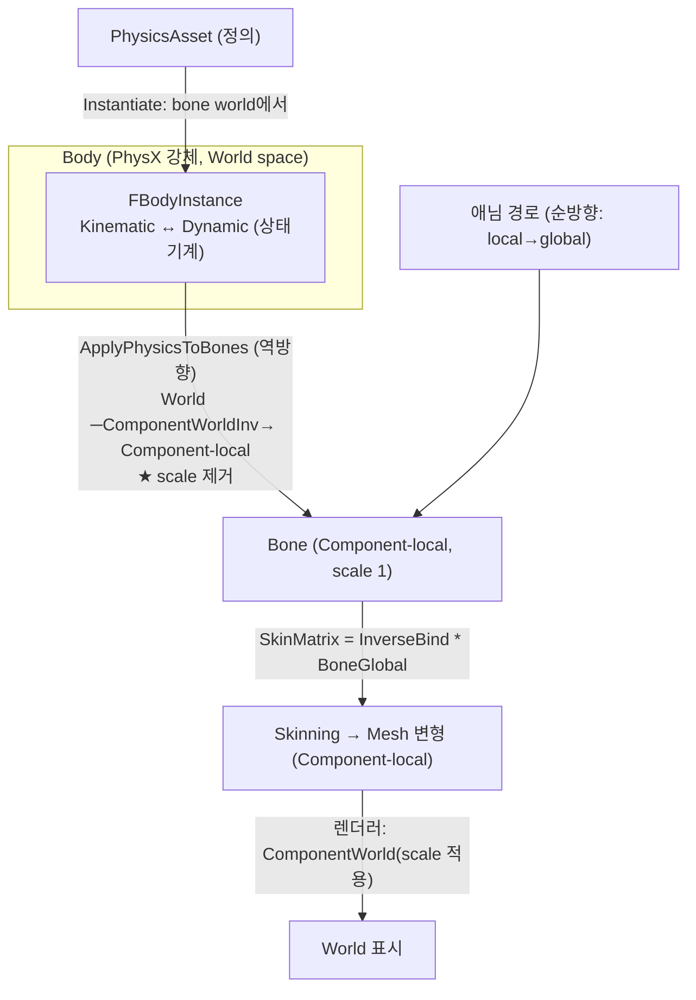

# 08. bone · body · skinning · physics 관계

> **대상**: 래그돌 write-back과 스키닝의 결합 구조 — "본·바디·스키닝·피직스가 하나의 좌표 변환 사슬로 엮여 있고, 애님과 피직스가 그 사슬을 서로 반대 방향으로 흐른다".
> **선행 읽기**: [00](00_overview.md) 파이프라인 → [06](06_coordinate_math.md) 수학규약 → [05](05_runtime_and_collision.md) 런타임/write-back. 이 문서는 그 위에서 **스키닝과의 접점**과 **좌표공간 일관성 버그**를 다룬다.
> **라인 번호는 확인 시점(2026-06-02) 스냅샷**이다. 인용마다 심볼명을 함께 적었으니 어긋나면 심볼로 재확인할 것. 엔진 소스 경로는 `KraftonEngine/Source/` 접두어 생략형.

---

## 1. 등장인물과 역할

| 개념 | 코드 타입 | 본질 | 비유 |
|---|---|---|---|
| **Bone(본)** | `FBone` | 스켈레톤 계층 노드. 트랜스폼을 가진 "관절" | 마리오네트의 관절 |
| **PhysicsAsset / BodySetup** | `UPhysicsAsset`, `UBodySetup` | **정의(템플릿)**. "어느 본에 어떤 셰이프를 붙일지" | 설계도 |
| **Body(바디)** | `FBodyInstance` | **런타임 PhysX 강체**. 실제 시뮬레이션되는 물리 객체 | 설계도로 만든 부품 |
| **Skinning** | `BuildSkinMatrices` / `UpdateCPUSkinning` | 본 자세를 받아 메시 정점을 변형 | 관절에 따라 늘어나는 살갗 |

한 줄: **PhysicsAsset(정의)로 Body(실체)를 만들고 → Body가 Bone을 움직이고 → Bone이 Skinning으로 Mesh를 변형한다.**

PhysicsAsset을 "참조/소유" 하는 것과 Body가 "존재" 하는 것은 다른 층위다. Body는 `InstantiatePhysicsAssetBodies`가 PhysX 씬에 실제로 생성해야 비로소 존재한다(런타임 자동 생성 경로 없음 — `SetSimulatingPhysics(true)`의 lazy 생성 또는 에디터 Simulate 버튼만 생성).

---

## 2. 좌표 공간 (모든 것의 뿌리)

정점 하나가 화면에 찍히기까지의 공간 사슬:

```
Bind space ──InverseBind──▶ Bone-local ──BoneGlobal──▶ Component-local ──ComponentWorld──▶ World
(메시 원본)                  (관절 기준)                 (캐릭터 기준, scale≈1)             (씬, scale 포함)
```

- **Bind space**: 메시 정점(`Asset->Vertices`)이 저장된 공간. "바인드(T-pose) 시점의 스켈레톤 공간".
- **Component-local**: 본 글로벌(`BoneGlobal`)이 사는 공간. 캐릭터 루트 기준, **스케일 1**.
- **World**: 렌더러가 마지막에 컴포넌트 월드행렬(씬의 스케일 포함)을 곱해 도달.

행렬 규약은 **행벡터** `v' = v·M` ([06](06_coordinate_math.md) 참조):

```
Global[i] = Local[i] * Global[parent]      // 자식 로컬이 왼쪽 → 부모 먼저 누적
```

본 배열이 **parent-first 정렬**이라 단순 순회로 부모 글로벌이 항상 먼저 채워진다 (`BuildBoneEditGlobalMatrices`, `SkinnedMeshComponent.cpp:940`, 누적식 `:958`).

---

## 3. 스키닝 수식 — 모든 것의 심장

```
SkinMatrix[b] = InverseBindPose[b] * BoneGlobal[b]
정점_변형     = Σ_b  weight_b · (정점_bind * SkinMatrix[b])
```

- `BuildSkinMatrices` (`SkinnedMeshComponent.cpp:1325`), 수식은 `:1346` `Asset->Bones[b].GetInverseBindPose() * BoneGlobals[b]`.
- 적용은 `UpdateCPUSkinning` (`:977`), 4본 가중 합 (`:1024~`).

`FBone`이 들고 있는 포즈들 (`Mesh/Skeletal/SkeletalMeshAsset.h:26-31`, 접근자 `:46-49`):
- `SkinBindGlobalPose` — 바인드 시점의 본 글로벌
- `InverseBindPoseMatrix` — 그 역행렬

**왜 이 수식인가:**
- `정점_bind * InverseBind` → 정점을 "그 본 기준 로컬"로 되돌림 (바인드 자세를 벗겨냄)
- `* BoneGlobal` → **현재** 본 자세로 다시 입힘

직관 검증: 현재 == 바인드이면 `SkinMatrix = InverseBind * Bind = I` → 메시 불변. 본이 움직인 만큼만 정점이 따라간다.

> **핵심 통찰:** 스키닝의 입력은 오직 **`BoneGlobal[b]` (component-local, scale 1)** 하나다. 누가 채우든 스키닝은 무관 → 애님·피직스가 **같은 스키닝 경로**를 공유한다.

---

## 4. 네 갈래 관계 (데이터 흐름)

### (A) Bone → Skinning : 항상 도는 본류
`SetBoneLocalTransforms(LocalPose)` (`SkinnedMeshComponent.cpp:608`) → `RefreshSkinningAfterPoseChanged` (`:1103`) → 로컬 누적 글로벌 → `SkinMatrix = InverseBind * Global`. 애님·피직스 모두 **결국 이 문으로** 들어온다.

### (B) 애니메이션 → Bone : "순방향"
`AnimInstance`가 본 **로컬 포즈**를 저자(authoring) → 누적 → 글로벌 → 스키닝. 작성은 로컬, 사용은 글로벌.

### (C) Bone ↔ Body : 양방향 변환 (피직스의 핵심)

**Bone → Body (생성, 1회)** — `InstantiatePhysicsAssetBodies` (`SkeletalMeshComponent.cpp:725`):
```
각 BodySetup:
  BoneIndex = FindBoneIndex(BodySetup.BoneName)
  바디를 GetBoneWorldTransformByIndex(BoneIndex) 위치에 생성      // 본의 현재 월드 자세에서 출발
  BodyType = bSimulatePhysics ? Dynamic : Kinematic   (:792)
  Bodies[BoneIndex] = 바디   (:815)                              // ★ 본 인덱스로 색인 → 역매핑이 공짜
```

**Body → Bone (write-back, 매 틱)** — `ApplyPhysicsToBones` (`SkeletalMeshComponent.cpp:1166`): **"역방향"**.
```
각 본(parent-first):
  바디 있음 → BoneGlobal(comp-local) = BodyWorld * ComponentWorldInv   // 월드→컴포넌트  (:1214)
              ↳ [★ 스케일 제거: scale-1 보장 — 5장]
  바디 없음 → BoneGlobal = RefLocal * ParentGlobal                     // 레퍼런스 포즈로 부모 추종
  LocalPose = BoneGlobal * ParentGlobal⁻¹                              // 글로벌→로컬 역산
  → SetBoneLocalTransforms (=A 경로)
```
- 애님은 **로컬을 만들어 글로벌로 쌓는데**, 피직스는 **월드 바디에서 글로벌을 얻어 로컬로 역산**한다. 정확히 반대 방향.
- 바디는 보통 주요 관절 ~15-20개만 존재. **바디 없는 본**(손가락·표정뼈 등)은 레퍼런스 로컬로 **피직스로 움직이는 부모를 그대로 추종**. → 래그돌 = "굵은 골격은 물리, 잔뼈는 강체 추종".

### (D) Physics 상태 기계 — Kinematic ↔ Dynamic
`TickComponent` 분기 (`SkeletalMeshComponent.cpp:1146`):
```
bSimulatingPhysics == true  → ApplyPhysicsToBones  (애님 평가 skip)   ← 래그돌
                  == false  → EvaluateAnimInstance (정상 애님)        ← 평소
```
- `SetSimulatingPhysics(true)` (`:1039`): 바디 없으면 lazy 생성 + `EnterRagdollState`(바디를 현재 본 월드로 teleport 후 **Dynamic**).
- `SetSimulatingPhysics(false)`: 바디를 **Kinematic**으로 되돌리고 플래그 off → 애님 복귀 (바디 유지 → 재진입 저렴).
- `EnterRagdollState` (`:990`)의 teleport 이유: kinematic 동안 쌓인 애님 포즈와 바디 자세의 격차로 인한 **튐** 방지.
- `CreateRagdoll` (`:1030`) = `EnterRagdollState`만 호출 (바디가 이미 있다는 전제 — 에디터식). 런타임에는 인스턴스화까지 하는 `SetSimulatingPhysics(true)`가 상위호환.

> Kinematic = "물리에 안 밀리고 위치를 지정"(애님이 운전), Dynamic = "중력·충돌로 물리가 운전". 래그돌은 운전대를 물리에게 넘기는 것.

---

## 5. "메시가 body에 꽉 끼는" 버그의 이론 — 좌표공간 일관성

**증상**: 런타임에서 메시가 바디에 쪼그라들어 끼는데, Physics Asset 에디터 Simulate는 멀쩡.

**진단**: 계산 로직은 동일하다(둘 다 `ApplyPhysicsToBones` 호출). 차이는 **입력(컴포넌트 월드 스케일)**.

| | 에디터 Simulate (프리뷰) | 런타임(씬) |
|---|---|---|
| 메시 컴포넌트 생성 | `AddComponent` 후 스케일 미설정 → **1** (`Editor/UI/Asset/Mesh/MeshEditorWidget.cpp:228-234`) | 씬 `RelativeTransform.Scale = [2,2,2]` (`Content/Scene/Default.Scene`) |
| `ComponentWorldInv`의 스케일 | 1 (무영향) | **0.5 (1/2)** |
| `BoneGlobal = BodyWorld * ComponentWorldInv` | 깔끔(scale 1) | **0.5 누수** |
| `SkinMatrix = InverseBind(scale1) * Global` | 정상 | 0.5 수축 → 꽉 낌 |

원리: PhysX 바디는 **무스케일 강체**인데 `ComponentWorldInv`엔 컴포넌트 스케일의 역수 1/S가 들어 있어, 그대로 두면 본 글로벌 선형부에 1/S가 새어든다. 스키닝은 `BoneGlobal`이 **component-local(scale 1)**일 것을 전제(바인드 포즈가 scale 1)하므로 깨진다. 스케일은 **렌더러의 컴포넌트 월드행렬에서 단 한 번만** 적용돼야 한다.

**왜 글로벌 단계에서 스케일을 제거해야 하나 (local 단계는 틀림):**
- 자식 로컬 = `자식글로벌 * 부모글로벌⁻¹`. 부모 글로벌이 0.5로 오염되면 자식 로컬 **translation**이 그 0.5 부모 기준으로 계산된다.
- 그런데 스키닝 재구성(`BuildBoneEditGlobalMatrices`)은 스케일 제거된 scale-1 부모로 다시 누적 → translation이 **2배로 어긋난다**.
- 따라서 **글로벌을 먼저 scale-1로 정규화**한 뒤 로컬을 역산해야 부모·자식이 같은 기준에서 일관된다. = 에디터가 (스케일 1로) 자연히 만들던 글로벌과 동일.

**수정** (`SkeletalMeshComponent.cpp` `ApplyPhysicsToBones`, body 분기): `BoneGlobal = BodyWorld * ComponentWorldInv` 직후 `FTransform`로 분해해 `Scale = 1`로 만든 뒤 다시 행렬화. (균등 스케일 가정 — 비균등은 `ToQuat` 추출이 손실되므로 미지원.)

```cpp
ComponentGlobal = BodyWorld.ToMatrix() * ComponentWorldInv;
FTransform GlobalNoScale(ComponentGlobal);
GlobalNoScale.Scale = FVector::OneVector;   // 1/S 누수 제거 → scale-1 보장
ComponentGlobal = GlobalNoScale.ToMatrix();
LocalMatrix = (ParentIndex >= 0) ? ComponentGlobal * ParentGlobal.GetInverse() : ComponentGlobal;
```

원리 한 줄: **변환 사슬의 한 마디(BoneGlobal)는 그 마디가 약속한 공간(component-local, scale 1)을 정확히 지켜야 한다. 스케일이 새면 다음 마디(skinning)가 깨진다.**

---

## 6. 한 장 요약도



- **애님**: 위→아래로 "본 로컬을 저자해 글로벌로 쌓아" 스키닝.
- **피직스**: 바디(월드)에서 출발해 "글로벌→로컬 역산" 후 **같은 스키닝 문**으로 합류.
- **스케일**은 오직 **맨 마지막 렌더러 단계**에서만 한 번 적용 — 중간(본 글로벌)에 새면 안 됨. ← 5장 수정의 본질.

---

## 7. 함께 보면 좋은 곳
- 런타임 step vs 에디터 step의 분담, write-back 트리거: [05](05_runtime_and_collision.md)
- 행/열벡터·쿼터니언·엔진↔PhysX 좌표 규약: [06](06_coordinate_math.md)
- 전체 파이프라인(자동생성→자산→인스턴스화→step→write-back): [00](00_overview.md)
